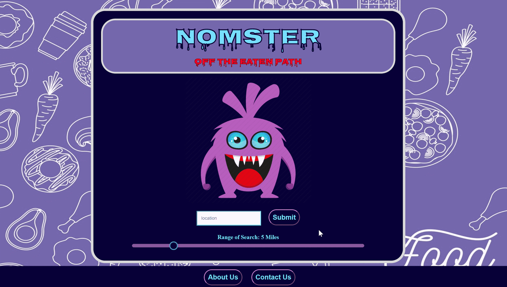

# group-4-project NOMSTER
Project Requirements
- Must use at least two server-side APIs
- Must use a CSS framework other than Bootstrap
- Use at least one new third-party API (Library)
- Must have a polished, mobile-first UI
- Must meet good quality coding standards (indentation, scoping, naming, etc.)
- Does NOT use alerts, confirms, or prompts (look into modals). 
- Must be deployed to GitHub Pages
- Must be interactive (i.e: accept and respond to user input)
- Must have User Input Validation
- Must have some repeating element / table

[Link to deployment Presentation](https://docs.google.com/presentation/d/1-0gOvWei5pVjOt75WLYcv4okRsctA2LJCFRDzzSyaiU/edit?usp=sharing)

**What is Nomster?**

Nomster provides you with suggestions for uncommon delicacies nearby for the adventurous foodie. Looking to experience new adventures in food? Try new things you wouldn’t normally think to look for? like , what is Goan food? I don’t know!!
Then this is the App for You!
Nomster uses Yelp and Bing APIs to present you with a list and map location of restaurants ranked from least to most prevalent in your area. 

## Built With

* [HTML](https://developer.mozilla.org/en-US/docs/Web/HTML)
* [CSS](https://developer.mozilla.org/en-US/docs/Web/CSS)
* [Javascript](https://developer.mozilla.org/en-US/docs/Web/JavaScript)
* [YelpAPI](https://www.yelp.com/developers)
* [BingMapsAPI](https://www.microsoft.com/en-us/maps/choose-your-bing-maps-api)
* [GoogleFonts](https://fonts.google.com/)
*[SemanticUI](https://semantic-ui.com/)

## Deployed Link

* [See Live Site](https://casey-moldavon.github.io/group-4-project/)

## Authors

* **Manuel Nunes, Casey Moldavon, Lucas Coffee** 

**Manuel Nunes**
- [Link to Portfolio Site]()
- [Link to Github]()
- [Link to LinkedIn]()

**Casey Moldavon**
- [Link to Portfolio Site](https://casey-moldavon.github.io/responsive-portfolio/)
- [Link to Github](https://github.com/casey-moldavon/group-4-project)
- [Link to LinkedIn](https://www.linkedin.com/in/casey-moldavon-442a1761/)

**Lucas Coffee**
- [Link to Portfolio Site](https://kalashnikoffee.github.io/responsive-bio/)
- [Link to Github](https://github.com/kalashnikoffee)
- [Link to LinkedIn](https://www.linkedin.com/in/lucas-coffee-08853719/)

## License

This project is licensed under the MIT License 

## Acknowledgments

Thanks again to Jerome, Kerwin, and Mahisha for their guidance.
